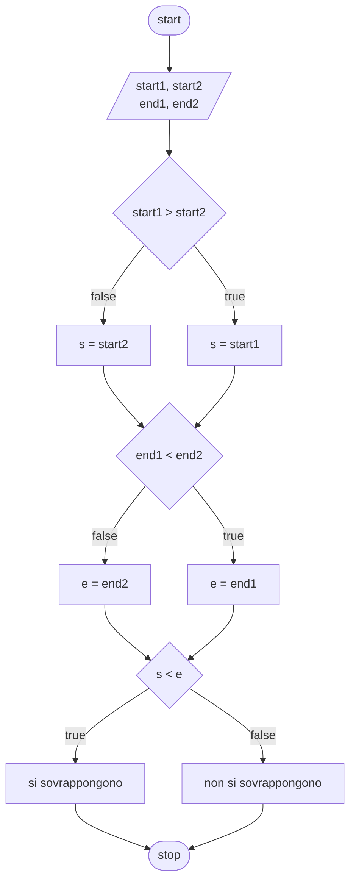
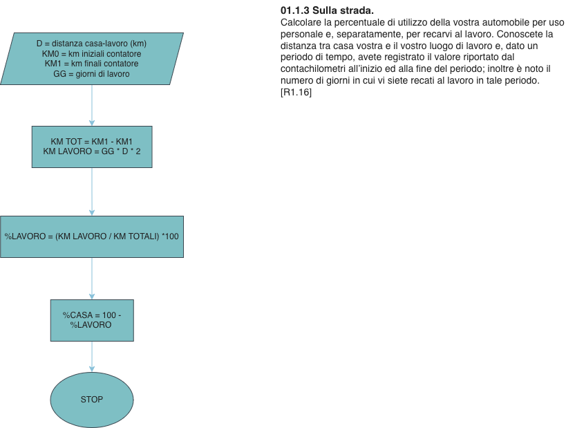
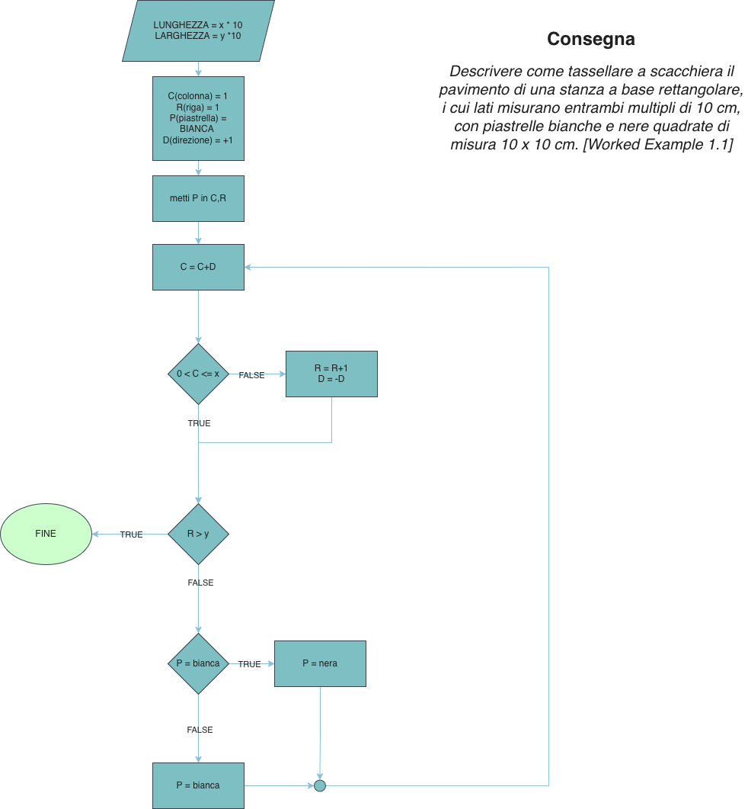

# Lab 01

## Parte 1

### Es 01.1.1: Appuntamenti

```
Se start1 > start2 
s = start1 

Altrimenti
s = start2 

Se end1 < end2
e = end1 
Altrimenti e = end2 

Se s < e 
Gli appuntamenti si sovrappongono 
Altrimenti Gli appuntamenti non si sovrappongono
```
---


### Es 01.1.2: Stagioni

### Es 01.1.3: Sulla strada



### Es 01.1.4: Piastrelle

