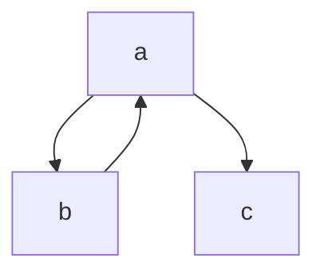

# Lab 01
## Parte 1
### Es 01.1.1: Appuntamenti
Se start1 > start2 
s = start1 

Altrimenti
s = start2 

Se end1 < end2
e = end1 
Altrimenti e = end2 Se s < e Gli appuntamenti si sovrappongono Altrimenti Gli appuntamenti non si sovrappongono

